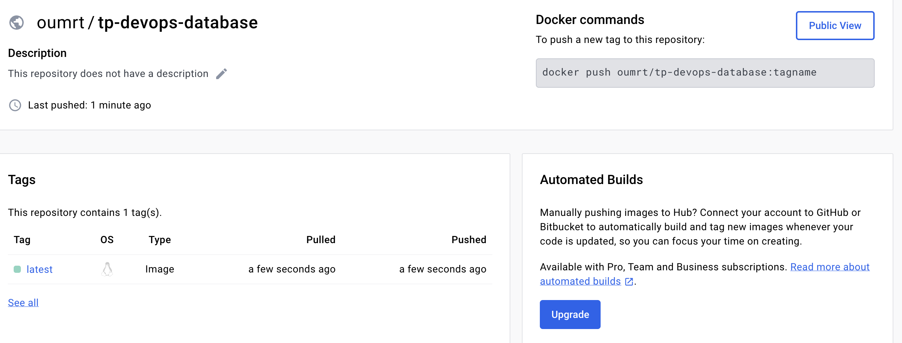

# DevOps - TP

# TP 1 : Docker

## 1. Database :

### commands :

- Build :

```yaml
docker build -t oumrt/myfirstapp .
```

```yaml
pull the adminer (web interface for database) :
```

```yaml
docker pull adminer
```

- Run the 2 containers using a shared network :

```yaml
docker run --net=app-network -p 5433:5432 -d oumrt/myfirstapp
```

```yaml
docker run -p "8090:8080"  --net=app-network --name=adminer -d adminer
```

Why should we run the container with a flag `-e` to give the environment variables?

- For security reason, it allows to enter env variables to access the database

```yaml
docker run --net=app-network -p 5433:5432 -e POSTGRES_PASSWORD=pwd -d oumrt/myfirstapp
```

Why do we need a volume to be attached to our postgres container?

- We need it to not lose the tables after stopping the container from running

```yaml
docker run --net=app-network -p 5433:5432 -v db:/var/lib/postgresql/data -e POSTGRES_PASSWORD=pwd -d oumrt/myfirstapp
```

```yaml
docker run —name postgres --net=app-network -p 5433:5432 -v db:/var/lib/postgresql/data -e POSTGRES_PASSWORD=pwd -d postgres
```

- Dockerfile :

```yaml
FROM postgres:14.1-alpine

ENV POSTGRES_DB=db \
POSTGRES_USER=usr

COPY ./db/01-CreateScheme.sql /docker-entrypoint-initdb.d
COPY ./db/02-InsertData.sql /docker-entrypoint-initdb.d
```

- Tree : 


## 2. Backend API v1

- Dockerfile :

```yaml
FROM openjdk:11

COPY . /usr/src/myapp

WORKDIR /usr/src/myapp

RUN javac Main.java

CMD ["java", "Main"]
```

- Build :

```bash
docker build -t my-java-app .
```

- Run :

```bash
docker run -it my-java-app
```

- Tree :


## **3. Multistage build**

### Dockerfile :

- Build stage

```bash
# Use Maven 3.8.6 with Amazon Corretto 17 as the base image for the build stage 
FROM maven:3.8.6-amazoncorretto-17 AS myapp-build 

# Set an environment variable MYAPP_HOME to specify the working directory inside the container 
ENV MYAPP_HOME /opt/myapp 

# Set the working directory inside the container to MYAPP_HOME (/opt/myapp) 
WORKDIR $MYAPP_HOME 

# Copy the project's pom.xml file into the working directory (/opt/myapp) inside the container COPY pom.xml . 
# Download all dependencies required for the project (including plugins) 
RUN mvn dependency:go-offline

# Copy the project's source code into the src directory in the working directory inside the container 
COPY src ./src 

# Run the Maven package command, skipping tests, to build the application 
RUN mvn package -DskipTests
```

- Run stage :

```bash
# Use Amazon Corretto 17 as the base image for the run stage 
FROM amazoncorretto:17 

# Re-define the MYAPP_HOME environment variable for use in this stage 
ENV MYAPP_HOME /opt/myapp 

# Set the working directory inside the container to MYAPP_HOME (/opt/myapp) for the run stage 
WORKDIR $MYAPP_HOME 

# Copy the built JAR file from the build stage to the working directory in the run stage container
COPY --from=myapp-build $MYAPP_HOME/target/*.jar $MYAPP_HOME/myapp.jar
```

- Build :

```bash
**docker build -t my-java-api .**
```

- Run **:**

```bash
**docker run -d -p 8080:8080 my-java-api**
```

## **4. Backend  API v2**

- Build

```bash
docker build -t oumrt/spring-app .
```

- Run

```bash
docker run --name spring-app --net=app-network -p 8080:8080 oumrt/spring-app
```

- appliactions.yml

```yaml
spring:
  jpa:
    properties:
      hibernate:
        jdbc:
          lob:
            non_contextual_creation: true
    generate-ddl: false
    open-in-view: true
  datasource:
    url: jdbc:postgresql://postgres:5432/db
    username: usr 
    password: pwd
    driver-class-name: org.postgresql.Driver
management:
 server:
   add-application-context-header: false
 endpoints:
   web:
     exposure:
       include: health,info,env,metrics,beans,configprops
```

## **5. Http server**

### Basic Dockerfile for html page :

- Dockerfile :

```docker
# Use the official Apache HTTP Server image
FROM httpd:2.4

# Copy the HTML file into the Apache server's root directory
COPY index.html /usr/local/apache2/htdocs/index.html
```

- Build :

```bash
docker build -t oumrt/simple-html-page .
```

- Run :

```bash
docker run --name simple-html-page-container -d -p 8000:80 oumrt/simple-html-page
```

- Copy server configuration :

```bash
docker cp simple-html-page-container:/usr/local/apache2/conf/httpd.conf .
```

## **6. Reverse proxy :**

- Why do we need a reverse proxy?

For load balancing and security reasons. 

- Config reverse-proxy :

```bash
ServerName localhost

<VirtualHost *:80>
ProxyPreserveHost On
ProxyPass / http://spring-app:8080/
ProxyPassReverse / http://spring-app:8080/
</VirtualHost>
LoadModule proxy_module modules/mod_proxy.so
LoadModule proxy_http_module modules/mod_proxy_http.so
```

- Dockerfile :

```docker
FROM httpd:2.4-alpine

# Copy the custom Apache configuration file into the container
COPY httpd.conf /usr/local/apache2/conf/httpd.conf

# Expose the port Apache is listening on
EXPOSE 80
```

- Build :

```bash
docker build -t oumrt/my-apache .
```

- Run :

```bash
docker run --name my-apache-container --net=app-network -p 8081:80 -d 
oumrt/my-apache
```

- Document docker-compose most important commands.  :

```yaml
# Define the Docker Compose file format version
version: '3.7'

# Define the services your application is composed of
services:
  # Database service configuration
  db:
    build: database                # Path to the Dockerfile for building the database image
    container_name: postgres-db    # Name of the created container
    environment:                   # Environment variables passed to the container
      - POSTGRES_DB=db             # Database name
      - POSTGRES_USER=usr          # Database user
      - POSTGRES_PASSWORD=pwd      # Database password
    networks:                      # Networks the service is connected to
      - app-network                # Connects to the 'app-network'

  # Spring Boot application service configuration
  springboot-app:
    build: simple-api-student      # Path to the Dockerfile for building the Spring Boot application image
    container_name: springboot-app-container # Name of the created container
    environment:                   # Environment variables passed to the container
      - URL=db:5432                # Database URL (uses the service name 'db' as hostname)
      - POSTGRES_DB=db             # Database name
      - POSTGRES_USER=usr          # Database user
      - POSTGRES_PASSWORD=pwd      # Database password
    networks:                      # Networks the service is connected to
      - app-network                # Connects to the 'app-network'
    depends_on:                    # Specifies that this service depends on the 'db' service
      - db                         # Ensures 'db' service is started first

  # Apache web server service configuration
  my-apache-server:
    build: .                       # Path to the Dockerfile for building the Apache server image, in this case, the current directory
    container_name: my-apache-server-container # Name of the created container
    ports:                         # Ports mapping from host to container
      - "8081:80"                  # Map host port 8081 to container port 80
    networks:                      # Networks the service is connected to
      - app-network                # Connects to the 'app-network'
    depends_on:                    # Specifies that this service depends on the 'springboot-app' service
      - springboot-app             # Ensures 'springboot-app' service is started first

# Define networks to be used by the services
networks:
  app-network:
    driver: bridge                 # Use the bridge driver for the network
```

- aplications.yaml

```yaml
datasource:
url: jdbc:postgresql://${URL}/${POSTGRES_DB}
username: ${POSTGRES_USER}
password: ${POSTGRES_PASSWORD}
driver-class-name: org.postgresql.Driver
```

```yaml
ProxyPass / [http://springboot-app:8080/](http://springboot-app:8080/)
ProxyPassReverse / [http://springboot-app:8080/](http://springboot-app:8080/)
```

- Why is **docker-compose** so important ?

Docker Compose is important because it simplifies the process of managing multi-container  applications. 

- Document docker-compose most important commands.

```yaml
docker-compose up -d #to launch the services in a detached mode (not to see logs on the command line)
```

```yaml
docker-compose up --build #build images based on the Dockerfile in the specified context and run the containers
```

## **7. Publish**

Réaliser principalement dans le TP 02 avec le déploiement continue.
Les différents containers : 
- Database : 


- Proxy : 


- Backend : 


# TP 2 : Git Actions

What are testcontainers ?

- Testcontainers is a Java library that supports JUnit tests, providing lightweight, throwaway instances of common databases or anything else that can run in a Docker container. Testcontainers make it easy for developers to manage and control the lifecycle of containers used during testing.

Document your Github Actions configurations.

- main.yaml

```yaml
name: CI devops 2023
on:
  #to begin you want to launch this job in main and develop
  push:
    branches: 
      - main
      - develop
  pull_request:

jobs:
  test-backend: 
    runs-on: ubuntu-22.04
    steps:
     #checkout your github code using actions/checkout@v2.5.0
      - name: Checkout code
        uses: actions/checkout@v2.5.0

     #do the same with another action (actions/setup-java@v3) that enable to setup jdk 17
      - name: Set up JDK 17
        uses: actions/setup-java@v3
        with:
          distribution: 'temurin'
          java-version: '17'

     #finally build your app with the latest command
      - name: Build and test with Maven
        working-directory: simple-api-student/
        run: mvn clean verify

         
  # define job to build and publish docker image
  build-and-push-docker-image:
    needs: test-backend
    # run only when code is compiling and tests are passing
    runs-on: ubuntu-22.04

    # steps to perform in job
    steps:
      - name: Checkout code
        uses: actions/checkout@v2.5.0

      - name: Login to DockerHub
        run: docker login -u ${{ secrets.DOCKERHUB_USERNAME }} -p ${{ secrets.DOCKERHUB_TOKEN }}

      - name: Build image and push backend
        uses: docker/build-push-action@v3
        with:
          # relative path to the place where source code with Dockerfile is located
          context: ./simple-api-student
          # Note: tags has to be all lower-case
          tags:  ${{secrets.DOCKERHUB_USERNAME}}/tp-devops-simple-api:latest
          # build on feature branches, push only on main branch
          push: ${{ github.ref == 'refs/heads/main' }}
      
      - name: Build image and push httpserver
        uses: docker/build-push-action@v3
        with:
          # relative path to the place where source code with Dockerfile is located
          context: ./httpserver/http
          # Note: tags has to be all lower-case
          tags:  ${{secrets.DOCKERHUB_USERNAME}}/tp-devops-simple-api:latest
          # build on feature branches, push only on main branch
          push: ${{ github.ref == 'refs/heads/main' }}
      

      - name: Build image and push database
        uses: docker/build-push-action@v3
        with:
          # relative path to the place where source code with Dockerfile is located
          context: ./database
          # Note: tags has to be all lower-case
          tags:  ${{secrets.DOCKERHUB_USERNAME}}/tp-devops-simple-api:latest
          # build on feature branches, push only on main branch
          push: ${{ github.ref == 'refs/heads/main' }}
```

# TP 3 : Ansible

## **Discover Ansible :**

- Testing server connection in ssh :

```yaml
all:
 vars:
   ansible_user: centos
   ansible_ssh_private_key_file: id_rsa
 children:
   prod:
     hosts: oumaima.rtayli.takima.cloud
```

```bash
ansible all -i inventories/setup.yml -m ping
```

- Connection successed :

```bash
oumaima.rtayli.takima.cloud | SUCCESS => {
    "ansible_facts": {
        "discovered_interpreter_python": "/usr/bin/python"
    },
    "changed": false,
    "ping": "pong"
}
```

- Check for Ansible ditribution :

```bash
ansible all -i inventories/setup.yml -m setup -a "filter=ansible_distribution*”
```

```yaml
oumaima.rtayli.takima.cloud | SUCCESS => {
    "ansible_facts": {
        "ansible_distribution": "CentOS",
        "ansible_distribution_file_parsed": true,
        "ansible_distribution_file_path": "/etc/redhat-release",
        "ansible_distribution_file_variety": "RedHat",
        "ansible_distribution_major_version": "7",
        "ansible_distribution_release": "Core",
        "ansible_distribution_version": "7.9",
        "discovered_interpreter_python": "/usr/bin/python"
    },
    "changed": false
}
```

- Testing launching tasks :

```yaml
ansible-playbook -i inventories/setup.yml playbook.yml
```

```yaml
PLAY [all] *************************************************************************************

TASK [Test connection] *************************************************************************
ok: [oumaima.rtayli.takima.cloud]

PLAY RECAP *************************************************************************************
oumaima.rtayli.takima.cloud : ok=1    changed=0    unreachable=0    failed=0    skipped=0    rescued=0    ignored=0
```

- Installation of Docker in the server via tasks :

```yaml
ansible-playbook -i setup.yml playbook.yml 
```

```yaml
PLAY [all] *************************************************************************************

TASK [Test connection] *************************************************************************
ok: [oumaima.rtayli.takima.cloud]

PLAY RECAP *************************************************************************************
oumaima.rtayli.takima.cloud : ok=1    changed=0    unreachable=0    failed=0    skipped=0    rescued=0    ignored=0   

oum@Oums-MacBook-Air inventories % ansible-playbook -i setup.yml playbook.yml --syntax-check

playbook: playbook.yml
oum@Oums-MacBook-Air inventories % ansible-playbook -i setup.yml playbook.yml --syntax-check

playbook: playbook.yml
oum@Oums-MacBook-Air inventories % ansible-playbook -i setup.yml playbook.yml               

PLAY [all] *************************************************************************************

TASK [Install device-mapper-persistent-data] ***************************************************
changed: [oumaima.rtayli.takima.cloud]

TASK [Install lvm2] ****************************************************************************
changed: [oumaima.rtayli.takima.cloud]

TASK [add repo docker] *************************************************************************
changed: [oumaima.rtayli.takima.cloud]

TASK [Install Docker] **************************************************************************
changed: [oumaima.rtayli.takima.cloud]

TASK [Install python3] *************************************************************************
changed: [oumaima.rtayli.takima.cloud]

TASK [Install docker with Python 3] ************************************************************
changed: [oumaima.rtayli.takima.cloud]

TASK [Make sure Docker is running] *************************************************************
changed: [oumaima.rtayli.takima.cloud]

PLAY RECAP *************************************************************************************
oumaima.rtayli.takima.cloud : ok=7    changed=7    unreachable=0    failed=0    skipped=0    rescued=0    ignored=0
```

- Testing that docker is installed on my server :

```bash
centos@ip-10-0-1-207 ~]$ docker --help

Usage:  docker [OPTIONS] COMMAND

A self-sufficient runtime for containers

Common Commands:
  run         Create and run a new container from an image
```

- Roles creation :

```bash
ansible-galaxy init roles/<ROLE_NAME> 
```

```bash
ansible-galaxy init roles/docker
ansible-galaxy init roles/network
ansible-galaxy init roles/database
ansible-galaxy init roles/app
ansible-galaxy init roles/proxy
```

- Docker main.yml :

```yaml
- name: Install device-mapper-persistent-data
  yum:
    name: device-mapper-persistent-data
    state: latest

- name: Install lvm2
  yum:
    name: lvm2
    state: latest

- name: add repo docker
  command:
    cmd: sudo yum-config-manager --add-repo=https://download.docker.com/linux/centos/docker-ce.repo

- name: Install Docker
  yum:
    name: docker-ce
    state: present

- name: Install python3
  yum:
    name: python3
    state: present

- name: Install docker with Python 3
  pip:
    name: docker
    executable: pip3
  vars:
    ansible_python_interpreter: /usr/bin/python3

- name: Make sure Docker is running
  service: name=docker state=started
  tags: docker
```

```yaml
ansible-galaxy init roles/docker
```

## Deploy the App :

Chaque sous dossier du dossier roles est un rôle & on peut les executer de puis le playbook.yml

Lancer les rôles depuis le `playbook.yml`:
  

```yaml
roles:
    - app
    - database
    - docker
    - network
    - proxy
```

```yaml

# Install Docker
- hosts: all
  gather_facts: false
  become: true
  vars_files:
    - group_vars/var.yml
  roles:
    - docker # install docker
    - network # créer un réseau pour les containers
    - database # lance la db
    - app # lance le backend
    - proxy # lance le reverse proxy
```

## Deploy your App :

Après création des rôles spécifiés, chacun doit exécuté une tâche. Leur ordre est important, il faut donc faire attention. Dans la continuité de nos secrets github, il faut rajouter des variables d'environements pour les **urls**, les **noms des containers**, le **réseau**,et les **tokens**.

Pour cela, on crée un fichier `group_vars\var.yml` :

```yaml
#db
POSTGRES_CONTAINER: postgres-db
POSTGRES_DB: db
POSTGRES_USER: usr
POSTGRES_PASSWORD: pwd

# docker network
DOCKER_NETWORK: app-network

#backend
API_CONTAINER: springboot-app-container
```

On le chiffre ensuite avec `ansible-vault`:

```yaml
ansible-vault encrypt ansible/group_vars/var.yml
```

On nous demande de saisir un mot de passe qui nous sera demander lors du déploiement.

Pour déchiffrer:

```yaml
ansible-vault decrypt ansible/group_vars/var.ym
```

Le reste des tasks : 

- network :

```yaml
- name: Create docker network
  community.docker.docker_network:
    name: "{{ DOCKER_NETWORK }}" 
  vars:
ansible_python_interpreter: /usr/bin/python3
```

- database :

```yaml
- name: Run database
  vars:
    ansible_python_interpreter: /usr/bin/python3
  docker_container:
    name: "{{ POSTGRES_CONTAINER }}"
    image: thomas0507/tp-database:latest
    networks:
      - name: "{{ DOCKER_NETWORK }}"
    env:
      POSTGRES_DB: "{{ POSTGRES_DB }}"
      POSTGRES_USER: "{{ POSTGRES_USER }}"
      POSTGRES_PASSWORD: "{{ POSTGRES_PASSWORD }}"
    volumes:
      - myvolume:/var/lib/postgresql/data
    recreate:
      true
    pull:
      true
```

- app :

```yaml

- name: Run Backend API
  vars:
    ansible_python_interpreter: /usr/bin/python3
  docker_container:
    name: "{{ API_CONTAINER }}" 
    image: thomas0507/tp-devops-simple-api:latest
    networks:
      - name: "{{ DOCKER_NETWORK }}" 
    env:
      URL: "{{ POSTGRES_CONTAINER }}:5432" 
      POSTGRES_DB: "{{ POSTGRES_DB }}" 
      POSTGRES_USER: "{{ POSTGRES_USER }}" 
      POSTGRES_PASSWORD: "{{ POSTGRES_PASSWORD }}"
    recreate: true
    pull: true
```

- proxy :

```yaml

- name: Run HTTPD
  vars:
    ansible_python_interpreter: /usr/bin/python3
  docker_container:
    name: httpd
    image: thomas0507/my-apache-server:latest
    networks:
      - name: "{{ DOCKER_NETWORK }}" 
    ports:
      - 8080:80
    recreate: true
    pull: true
```

Étant donné qu'on a chiffré notre `var.yml`, il faut absolument entré le mot de passe de la `vault` lors du déploiement :

```bash
sudo ansible-playbook --ask-vault-pass -i ansible/inventories/setup.yml ansible/playbook.yml

```
- Déploiement sur le serveur : 


### Authors :

- [@OumaimaRTAYLI]([https://github.com/OumaimaRTAYLI/](https://github.com/OumaimaRTAYLI/))